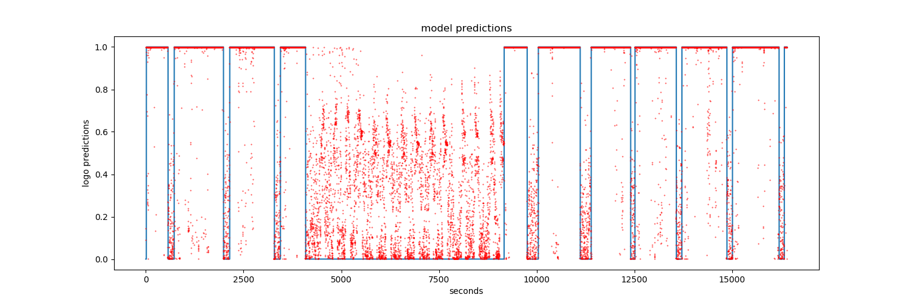

# Gedanken
## 15.06.2018
Die Generator Implementierung ist nicht so allgemein Gültig und man müsste
dann immer viel selber machen. Werde eine Hilfsklasse machen.

Hab die fit funktion im Netzwerk aufgeräumt

Generator classe sollte multithreadning können,
da ich viel Zeit verliere durch http request und
sonst ist es auch nicht schlecht. Probiere es mit einem
[Condition Objects](https://docs.python.org/3/library/threading.html#condition-objects)
und einer Queue.

Implementiert. Probleme: Die Queue liste kann zu gross werden
für den Speicher. Der Generator wird noch nicht
beendet obwohl er schon fertig ist.
## 16.06.2018
Der Generator ist so implementiert, dass man 2 funktionen
immer selber implementieren muss. `get_mini_batches` stellt die mini_batches
her. Die return value von der funktion muss immer in einer liste sein, so dass
man auch mehr als nur Item zurückgeben kann. Also `[Item]` oder `[Item, Item]`,
aber nicht `Item`. Die zweite funktion ist die `__len__()`, damit ich weiss
wie oft ich die `get_mini_batches` aufrufen muss.
Das Multithreadning wird automatisch von der Base classe übernommen.

Queue ist für meine Zwecke nicht geeignet, da ich mehr als ein
Element jeweils aus der Liste haben muss. Eine Liste die ich slicen kann
eignet sich einiges besser für diese Anwendung.

Das Problem, dass die Threads nicht aufhören wenn die liste schon lang genug
ist löse ich am besten mit einem zweiten Condition Object. Wird es
auch schneller machen, da dann die liste mit den Items nicht mehr die
ganze Zeit von den Threads blockiert wird.

Ein Problem könnte noch sein, dass die Threads vom Generator schon
anfangen obwohl das Netzwerk noch nicht initialisiert ist und es
deswegen ziemlich lange braucht um anzufangen.

Muss noch den Generator richtig beenden(Threads schliessen etc) und
auch wieder reinitialisieren. Bin mir nicht sicher ob ich die Threads
noch joinen muss oder nicht, da alle schon nicht mehr "leben".
 Glaub aber nicht das es schadet

Der Generator funktioniert nicht mit Multicoreprocesse, da
die Liste nicht SharedMemory ist. Fürs Threadning war das egal, da
dort alles SharedMemory ist.

## 17.06.2018

Mithilfe des Managers kann man ziemlich einfach SharedMemory
implementieren, dabei muss man aber sehr aufpassen, da der Process
alles was es braucht pickelt und wenn man den Manager pickelt gibt
es eine Fehlermeldung, d.h. der Manager darf nicht in der Klasse sein
oder muss man irgenwie Unsichtbar machen vom Process. Muss noch schauen
wie ich das am besten Löse.

Ich lösch einach die referenz des Manager aus dem dict der Klasse, so
dass es nicht gepickelt werden kann. Aber dadurch habe ich keinen Zugriff
auf den Manager. Was im Moment kein Problem ist. Sonst funktioniert der
Generator ziemlich gut.

#### Generator Vergleich
mini_batch_size = 128
##### Multicore 1 worker
mini_batch num: 0 | time: 5.13

mini_batch num: 1000 | time: 181.22
##### Multicore 2 worker
mini_batch num: 0 | time: 8.62

mini_batch num: 1000 | time: 177.53
##### Multicore 3 worker
mini_batch num: 0 | time: 15.46

mini_batch num: 1000 | time: 181.12
##### Old Generator
mini_batch num: 0 | time: 7.64

mini_batch num: 1000 | time: 231.46
<br><br>
Der Multicore Generator ist besser als der Alte. Aber mehr workers
macht ihn nicht viel schneller, was wahrscheinlich darin liegt das ich viele
Locks benutze, die sich gegenseitig blockieren.

#### Parallelling
Ich hab mir verschiedene Arten von Parallelisierung von einem
Neuronalen Netzwerk angeschaut. Darunter waren Pipline, large scale distributed und
anderes. Am meisten hat mir der [Hogwild Alogrithmus](https://arxiv.org/abs/1106.5730)
gefallen, da einfach zu implementieren ist und auch gut zu funktionieren scheint

## 18.06.2018
Nach Hogwild muss ich nur in den Layers SharedMemory bereit stellen.
Der Optimizer speichert auch daten, aber ich glaub das ist ok wenn
jeder Process seinen eigenen Optimizer hat.

Nach langem probieren ist mir aufgefallen, dass der Hogwild Alogrithmus
nicht implementierbar ist in Python, da das SharedMemory auf picklen und
hin und herschicken mit Pipes basiert, aber für Hogwild  bräuchte ich
eine atomic funktion, die es so nicht in Python gibt. Ich weiss gar nicht
ob es sich überhaupt lohnen kann, das Netzwerk zu parallelisieren, da Python
einfach nicht dafür gemacht worden ist. Ich gebe das Parallelisieren auf und
werden es vielleicht später nochmal probieren

Hab den Convolution Layer implementiert. Hab viel Code von Webseiten.

Implementierung von MaxPoolLayer mit einer BasePool Layer Klasse für
einfache implementierung einer weitern Pool Klasse

Flatten Layer hinzugefügt um von einem Convlayer zu einem FullyConnected
zu kommen. Ausserdem hab ich den ndarray vom "alten" Netzwerk umgedreht, d.h
von `[daten, mini_batch_size]` zu `[mini_batch_size, daten]`, da es so
allgemein gültiger ist und mit dem convlayer übereinstimmt, da bei dem `daten`
mehrere Werte sind und durch die Umdrehung bleibt `mini_batch_size`  immer
an der ersten Stelle.(Umstellung noch nicht am Generator und am Batchnormlayer)

## 19.06.2018

Batchnorm mit Convolution kompatibel

Der Convoultion Layer funktioniert gut, aber es braucht ewig zum lernen
mit dem Netzwerk:
```
train_data, train_labels, test_data, test_labels = load_conv()
net = Network()

net.input((1, 28, 28))

net.add(ConvolutionLayer(n_filter=32, width_filter=3, height_filter=3, stride=1, zero_padding=0))
net.add(BatchNorm())
net.add(ReLU())
net.add(ConvolutionLayer(n_filter=64, width_filter=3, height_filter=3, stride=1, zero_padding=0))
net.add(BatchNorm())
net.add(ReLU())
net.add(MaxPoolLayer(width_filter=2, height_filter=2, stride=1))
net.add(Dropout(0.75))
net.add(Flatten())
net.add(FullyConnectedLayer(128))
net.add(ReLU())
net.add(Dropout(0.5))
net.add(FullyConnectedLayer(10))
net.add(SoftMax())

optimizer = Adam(learning_rate=0.01)
net.regression(optimizer=optimizer, cost="cross_entropy")

net.fit(train_data, train_labels, validation_set=(test_data, test_labels), epochs=12, mini_batch_size=256,
        plot=True, snapshot_step=2)
net.evaluate(test_data, test_labels)
```
bräuchte es 16 Stunden.

Deswegen hab ich die numpy libary mit cupy ersetzt. Sie funktioniert
genau gleich(bis auf kleine Ausnahmen), aber sie arbeitet mit der GPU
mithilfe von CUDA, d.h es funktioniert nur wenn CUDA installiert ist und
man eine NVIDIA GPU hat. Ueber die GPU lernt das Netzwerk 10 Mal schneller, d.h
es  braucht "nur" noch 1.6 Stunden. Im Moment geht es aber nur mit CUDA
und nicht mehr über die CPU.

Hab alles kompatible mit cupy gemacht.(Ausser Generator)

## 20.06.2018

Um auch ohne GPU und Cupy das Netzwerk zu benutzen habe ich ein Wrapper-Module
für numpy and cupy entwickelt, da beide die gleiche api benutzen. Mit dem
Wrapper kann jeder Zeit von numpy auf cupy umstellen, sollte man aber
am besten nur einmal am Anfang machen(default ist numpy).

### Testlauf
setup:
```
train_data, train_labels, test_data, test_labels = load_conv()

net = Network()

net.use_gpu = True

net.input((1, 28, 28))

net.add(ConvolutionLayer(n_filter=32, width_filter=3, height_filter=3, stride=1, zero_padding=0))
net.add(BatchNorm())
net.add(ReLU())
net.add(ConvolutionLayer(n_filter=64, width_filter=3, height_filter=3, stride=1, zero_padding=0))
net.add(BatchNorm())
net.add(ReLU())
net.add(MaxPoolLayer(width_filter=2, height_filter=2, stride=1))
net.add(Dropout(0.75))
net.add(Flatten())
net.add(FullyConnectedLayer(128))
net.add(ReLU())
net.add(Dropout(0.5))
net.add(FullyConnectedLayer(10))
net.add(SoftMax())

optimizer = Adam(learning_rate=0.03)
net.regression(optimizer=optimizer, cost="cross_entropy")

net.fit(train_data, train_labels, validation_set=(test_data, test_labels), epochs=22, mini_batch_size=512,
        plot=True, snapshot_step=10)
net.evaluate(test_data, test_labels)
```
Für 22 Epochs hat meine GPU(780 GTX) 3.5 Stunden gebraucht

```
Evaluation with 10000 data:
loss: 0.03619 | accuracy: 0.98700
```

### Colab
Hab die Struktur vom Ordner aufgeräumt, so das es leichter zu benutzen
ist. Vor allem aus dem Grund, das ich dann das [Colab](https://colab.research.google.com/)
einfacher benutzen kann. Tenserflow Ordner hab ich gelöscht, da er nicht
wirklich reingepasst hat. Werde ihn vielleicht später wieder rein
nehmen um Vergleiche anzustellen

Hab ersten Colab versuch gemacht: [Mein Colab](https://colab.research.google.com/drive/1Uq9kIGxhfTSdy-aHziWgWcj2fLuT22oV)

## 21.06.2018
Habe Colab gefixed und sollte jetzt

Schneller save funktion, kann aber nicht mehr das ganze Netzwerk mit
der Struktur sicheren, sondern nur noch die Parameter.

## 22.06.2018

Habe die funktionen vom app Ordner aufgeräumt und ermöglicht, dass
man das Bild Farbig trainieren kann.

Jetzt ist das wichtigste implementiert, damit ich anfangen kann, dass
best mögliche netzwerk zu finden, dass das prosieben Logo erkennen kann.
Das Logo kann an 3 Orten auf dem Bild sein. Die Frage ist ob ich ein Netzwerk
trainiere, dass alle 3 Orten erkennt mit einem Bild oder ob ich dem
Netzwerk 3 Bilder gebe und er soll schauen ob in einem der 3 Bilder das Logo ist.

Bei cv2 ist die erste Stelle nicht die Breite sondern die Höhe und die zweite
    Stelle die Breite und nicht die Höhe. Hat mich nur sehr verwirrt.

Ich hab probiert nur mit einem Bild alle 3 Stellen abzudecken, lauf aber
in grosse Memory probleme hinein, da das Bild so gross wird. Ich hab 6GB Video
Memory

Im Output steht manchmal "nan", da `log(n)` mit `n=0` "nan" ergibt

## 23.06.2018
Trainiere das Netzwerk jetzt auf [colab](https://colab.research.google.com/drive/1Uq9kIGxhfTSdy-aHziWgWcj2fLuT22oV),
da ich dort 12GB Ram habe.

## 01.07.2018
Habe ein Netzwerk trainiert mit einem f1_score von 0.988.

Werde jetzt von Zattoo auf Teleboy wechseln, da ich dort relative einfach
den HD Stream anzapfen kann. Das heisst auch, dass ich das Logo neu
"finden" muss.
## 10.07.2018
Um vorherzusagen ob ein Logo im Bild, ohne zu wissen wo es genau ist, lasse ich jeden Pixel
durchs Netzwerk laufen und schau wie dieses Bild, dann ausschaut.

Im moment kann man nur das Bild generieren.
## 15.07.2018
Ich habe ein paar Bilder generieren lassen und es braucht viel zu lange
ca 14 min, was einfach viel zu lange ist. Und sobald weisse Flächen im Bild
sind wird es unvorhersehbar, da das Netzwerk nicht gut unterscheiden kann
zwischen Logo und weisser Flächen. Sieht man gut am Bild in app/prosieben/networks/prediction1
## 22.07.2018
Ein schwarz-weisses Bild lernt schneller und besser als ein
farbiges
## 25.07.2018
Habe ein Netzwerk trainiert, dass das ganze Prosiebenbild als input
nimmt. Die training_accuracy war auf ungefähr 95.7 %.

1 bedeutet Logo und 0 bedeutet kein Logo


Jeder Punkt ist der durchschnittliche Output vom Netzwerk von  von einer sekunde (30 Bilder).


Gleich wie der ander Graf, aber nur ein Bild anstatt 30.

Das erste was einem direkt auffällt sind die Punkte in der
Mitte. Zu dem Zeitpunkt lief gerade MediaShop TV, wo kein
Prosieben-Logo eingespielt worden ist und deswegen ist so
lange "Werbung".

Ansonsten sieht man schön, dass wenn ein Logo vorhanden ist, ist es
sehr sicher und wenn es keinen findet ist es sehr unsicher. Dies ist verständlich,
da es auf weissen Flächen unmöglich ist ein Logo zu erkennnen, da es gleich
ausschauen würde, selbst wenn ein Logo dort wäre.

Die heisst, wenn ich sagen will ob Werbung läuft schau ich hauptsächlich
ob es sicher ist das ein Logo ist, d.h die Werte zwischen 0.9 und 1
sind die wichtigsten

Die Frage ist ob ich Real-time eine gute classification machen, kann
da es immer kleine fehler gibt.

## 26.07.2018



die roten Punkte sind die resultate vom netzwerk.
Blau ist die verarbeitung der roten Punkte in eindeutige klassifikation

#### Der Algorithmus
```
array = np.array(dd.io.load("thoughts/assets/frame_points.h5"))
filters = []
result = []

filter_size = 10
chain_size = 5

for i in range(len(array)):
    snippet = array[i-filter_size:i]
    if np.any(snippet > 0.97):  # checks if network is sure that it found a logo
        filters.append(1)
    else:
        filters.append(0)

    last_filter = filters[-1]
    if np.all(np.array(filters[-chain_size:]) == last_filter):  # checks if the last values are the same
        if filters[-1] == 1:
            if np.mean(array[i-chain_size:i]) > 0.8:
                result.append(last_filter)
            else:
                result.append(result[-1])
        else:
            result.append(last_filter)
    else:
        result.append(result[-1])
```

Das Prinzip basiert darauf, dass das Netzwerk so sicher ist, wenn es
ein Logo erkennt, d.h ich nehms als Logo nur wenn es zu 97% sicher ist.
Im 2 Teil gehts ums umschalten zwischen "Logo" und "keinem Logo", d.h
es wird erst Umgeschaltet, wenn es vorher 5 mal das gleiche bekommen hat.
Es schaltet auch nur zu Logo, wenn der Durchschnitt mindestens über 0.8 ist.

##### Folgerungen
Von Logo zu keinem Logo kann es erst nach minimal filter_size+chain_size
in dem Fall nach 15 sekunden, dass heisst die klassifikation ist
mindesten 15 sekunden zu spät.

Von keinem Logo zu Logo braucht man aber nur minimal chain_size, da man
im ersten Teil nur einer das Kriterium erfüllen muss.
Es ist auch viel wichtiger, dass man von keinem Logo zu Logo schnell
wechselt als andersrum, da man diesen Wechsel als benutzer nicht
selber sehen würde

Zu beachten ist das der Algorithmus in real-time laufen kann.

Note: Die Hyperparameter sind ganz genau an die Daten angepasst und
man müsste noch schauen wie man mit neuen Daten klarkommt.

### Prosieben Teleboy Plots
Zur Vollständigkeit.


## 27.07.2018
Mit denen Hyperparameter gehts besser:
```
filter_size = 25
   if np.any(snippet > 0.9):
   if np.mean(array[i-chain_size:i]) > 0.9):
```

Es gibt ab und zu noch fehler, da ich nicht die filter size zu extrem erhöhen
will.


note: Jeder rote Punkt ist ein einzelner Frame. Ein Frame pro Sekunde

